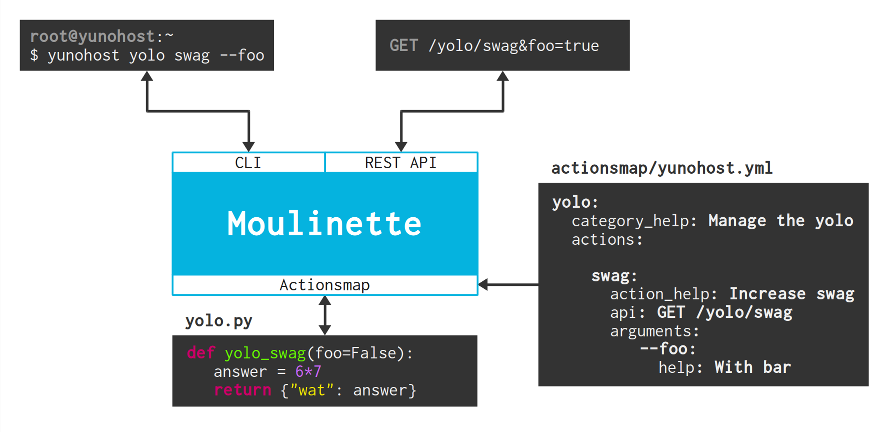

=================================
Role and syntax of the actionsmap
=================================

.. _actionmap:

Principle
=========

The actionsmap allows to easily define commands and their arguments through
a YAML file. Moulinette will automatically make the command available through
the CLI and Rest API, and will be mapped to a python function.

The illustration below summarizes how it works :

Format of the actionmap
=======================

General description of categories/subcategories, actions, arguments.

Authentication configuration
----------------------------

Document the `configuration: authenticate: all` LDAP stuff ... 

Special options for arguments
-----------------------------

Document `nargs`, `metavar`, `extra: pattern`

