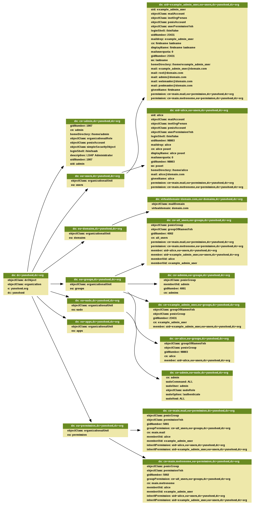
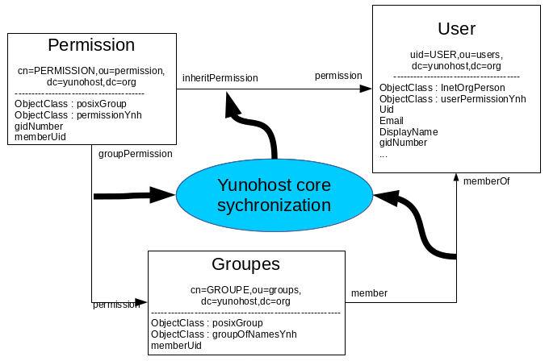
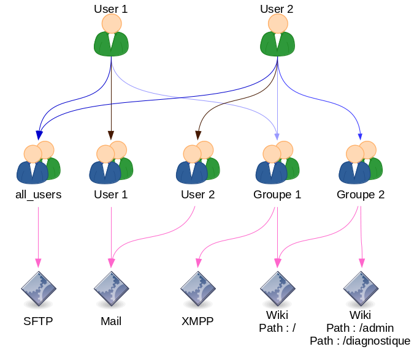

=================================================
Common LDAP operation (for YunoHost but not only)
=================================================

Moulinette is deeply integrated with LDAP which is used for a series of things
like:

* storing users
* storing domains (for users emails)
* SSO

This page document how to uses it on a programming side in YunoHost.

Getting access to LDAP in a command
===================================

To get access to LDAP you need to authenticate against it, for that you need to
declare your command with requiring authentication in the :ref:`actionsmap` this way:

::

    configuration:
        authenticate: all

Here is a complete example:

::

    somecommand:
        category_help: ..
        actions:

            ### somecommand_stuff()
            stuff:
                action_help: ...
                api: GET /...
                configuration:
                    authenticate: all

This will prompt the user for a password in CLI.

If you only need to **read** LDAP (and not modify it, for example by listing
domains), then you prevent the need for a password by using the
:file:`ldap-anonymous` authenticator this way:

::

    configuration:
        authenticate: all
        authenticator: ldap-anonymous

Once you have declared your command like that, your python function will
received the :file:`auth` object as first argument, it will be used to talk to
LDAP, so you need to declare your function this way:

::

    def somecommand_stuff(auth, ...):
        ...

auth in the moulinette code
---------------------------

The :file:`auth` object is an instance of :file:`moulinette.authenticators.ldap.Authenticator` class.

Here its docstring:

.. autoclass:: moulinette.authenticators.ldap.Authenticator

LDAP Schema
===========

This is a generated example of the ldap schema provided by YunoHost
(to generate this graph uses :file:`make ldap_graph`, you'll need graphviz):

Reading from LDAP
=================

Reading data from LDAP is done using the :file:`auth` object received as first
argument of the python function. To see how to get this object read the
previous section.

The API looks like this:

::

    auth.search(ldap_path, ldap_query)

This will return a list of dictionary with strings as keys and list as values.

You can also specify a list of attributes you want to access from LDAP using a list of string (on only one string apparently):

::

    auth.search(ldap_path, ldap_query, ['first_attribute', 'another_attribute'])

For example, if we request the user :file:`alice` with its :file:`homeDirectory`, this would look like this:

::

    auth.search('ou=users,dc=yunohost,dc=org', '(&(objectclass=person)(uid=alice))', ['homeDirectory', 'another_attribute'])

And as a result we will get:

::

    [{'homeDirectory': ['/home/alice']}]

Notice that even for a single result we get a **list** of result and that every
value in the dictionary is also a **list** of values. This is not really convenient and it would be better to have a real ORM, but for now we are stuck with that.

Apparently if we don't specify the list of attributes it seems that we get all attributes (need to be confirmed).

Here is the method docstring:

.. automethod:: moulinette.authenticators.ldap.Authenticator.search

Users LDAP schema
-----------------

According to :file:`ldapvi` this is the user schema (on YunoHost >3.7):

::

    # path: uid=the_unix_username,ou=users,dc=yunohost,dc=org
    uid: the_unix_username
    objectClass: mailAccount
    objectClass: inetOrgPerson
    objectClass: posixAccount
    objectClass: userPermissionYnh
    loginShell: /bin/false
    uidNumber: 80833
    maildrop: the_unix_username  # why?
    cn: first_name last_name
    displayName: first_name last_name
    mailuserquota: some_value
    gidNumber: 80833
    sn: last_name
    homeDirectory: /home/the_unix_username
    mail: the_unix_username@domain.com
    # if the user is the admin he will also have the following mails
    mail: root@domain.com
    mail: admin@domain.com
    mail: webmaster@domain.com
    mail: postmaster@domain.com
    givenName: first_name
    memberOf: cn=the_unix_username,ou=groups,dc=yunohost,dc=org
    memberOf: cn=all_users,ou=groups,dc=yunohost,dc=org
    permission: cn=main.mail,ou=permission,dc=yunohost,dc=org
    permission: cn=main.metronome,ou=permission,dc=yunohost,dc=org

The admin user is a special case that looks like this:

::

    # path: cn=admin,dc=yunohost,dc=org
    gidNumber: 1007
    cn: admin
    homeDirectory: /home/admin
    objectClass: organizationalRole
    objectClass: posixAccount
    objectClass: simpleSecurityObject
    loginShell: /bin/bash
    description: LDAP Administrator
    uidNumber: 1007
    uid: admin

Other user related schemas:

::

    # path: cn=admins,ou=groups,dc=yunohost,dc=org
    objectClass: posixGroup
    objectClass: top
    memberUid: admin
    gidNumber: 4001
    cn: admins

    # path: cn=admin,ou=sudo,dc=yunohost,dc=org
    # this entry seems to specify which unix user is a sudoer
    cn: admin
    sudoCommand: ALL
    sudoUser: admin
    objectClass: sudoRole
    objectClass: top
    sudoOption: !authenticate
    sudoHost: ALL

Reading users from LDAP
-----------------------

The user schema is located at this path: :file:`ou=users,dc=yunohost,dc=org`

According to already existing code, the queries we uses are:

* :file:`'(&(objectclass=person)(!(uid=root))(!(uid=nobody)))'` to get all users (not that I've never encountered users with :file:`root` or :file:`nobody` uid in the ldap database, those might be there for historical reason)
* :file:`'(&(objectclass=person)(uid=%s))' % username` to access one user data

This give us the 2 following python calls:

::

    # all users
    auth.search('ou=users,dc=yunohost,dc=org', '(&(objectclass=person)(!(uid=root))(!(uid=nobody)))')

    # one user
    auth.search('ou=users,dc=yunohost,dc=org', '(&(objectclass=person)(uid=some_username))')

Apparently we could also access one user using the following path (and not query): :file:`uid=user_username,ou=users,dc=yunohost,dc=org` but I haven't test it.

If you want specific attributes look at the general documentation on how to read from LDAP a bit above of this section.

Group LDAP schema
-----------------

According to :file:`ldapvi` this is the user schema (on YunoHost >3.4):

The groups will look like this:

::

    dn: cn=the_unix_username,ou=groups,dc=yunohost,dc=org
    objectClass: top
    objectClass: groupOfNamesYnh
    objectClass: posixGroup
    gidNumber: 48335
    cn: the_unix_username
    structuralObjectClass: posixGroup
    member: uid=the_unix_username,ou=users,dc=yunohost,dc=org

By default you will find in all case a group named `all_users` which will contains all Yunohost users.

::

    # path dn: cn=all_users,ou=groups,dc=yunohost,dc=org
    objectClass: posixGroup
    objectClass: groupOfNamesYnh
    gidNumber: 4002
    cn: all_users
    structuralObjectClass: posixGroup
    permission: cn=main.mail,ou=permission,dc=yunohost,dc=org
    permission: cn=main.metronome,ou=permission,dc=yunohost,dc=org
    member: uid=the_unix_username,ou=users,dc=yunohost,dc=org
    memberUid: the_unix_username

Reading group from LDAP
-----------------------

The group schema is located at this path: :file:`ou=groups,dc=yunohost,dc=org`

The queries we uses are the 2 following python calls:

::

    # all groups
    auth.search('ou=groups,dc=yunohost,dc=org', '(objectclass=groupOfNamesYnh)')

    # one groups
    auth.search(base='ou=groups,dc=yunohost,dc=org', filter='cn=' + groupname)

Permission LDAP schema
----------------------

According to :file:`ldapvi` this is the user schema (on YunoHost >3.4):

The permission will look like this:

::

    dn: cn=main.mail,ou=permission,dc=yunohost,dc=org
    objectClass: posixGroup
    objectClass: permissionYnh
    gidNumber: 5001
    groupPermission: cn=all_users,ou=groups,dc=yunohost,dc=org
    cn: main.mail
    structuralObjectClass: posixGroup
    memberUid: the_unix_username
    inheritPermission: uid=the_unix_username,ou=users,dc=yunohost,dc=org

By default you will have a permission for the mail and for metronome. When you install an application a permission also created.

Reading permissions from LDAP
-----------------------------

The permission schema is located at this path: :file:`ou=permission,dc=yunohost,dc=org`

The queries we uses are the 2 following python calls:

::

    # For all permission
    auth.search('ou=permission,dc=yunohost,dc=org', '(objectclass=permissionYnh)')

    # For one permission
    auth.search(base='ou=permission,dc=yunohost,dc=org', filter='cn=' + permission_name)

Domain LDAP schema
------------------

According to :file:`ldapvi` this is the domain schema (on YunoHost 2.7):

::

    10 virtualdomain=domain.com,ou=domains,dc=yunohost,dc=org
    objectClass: mailDomain
    objectClass: top
    virtualdomain: domain.com

Adding data in LDAP
===================

If you add an object linked to user, group or permission you need run the function `permission_sync_to_user` to keep integrity of permission in LDAP.

Adding stuff in LDAP seems pretty simple, according to existing code it looks like this:

::

    auth.add('key=%s,ou=some_location', {'attribute1': 'value', ...})

They weird stuff is the path you need to create. This looks like that for domain and users:

::

    # domain
    auth.add('virtualdomain=%s,ou=domains' % domain, attr_dict)

    # user
    auth.add('uid=%s,ou=users' % username, attr_dict)

You need to respect the expected attributes. Refer to the schema for that.

:file:`auth.add` seems to return something false when it failed (None probably)
so you need to check it's return code.

Here is the docstring:

.. automethod:: moulinette.authenticators.ldap.Authenticator.add

Adding user in LDAP
-------------------

Here is how it's done for a new user:

::

    auth.add('uid=%s,ou=users' % username, {
        'objectClass': ['mailAccount', 'inetOrgPerson', 'posixAccount'],
        'givenName': firstname,
        'sn': lastname,
        'displayName': '%s %s' % (firstname, lastname),
        'cn': fullname,
        'uid': username,
        'mail': mail,
        'maildrop': username,
        'mailuserquota': mailbox_quota,
        'userPassword': user_pwd,
        'gidNumber': uid,
        'uidNumber': uid,
        'homeDirectory': '/home/' + username,
        'loginShell': '/bin/false'
    })

Adding a domain in LDAP
-----------------------

Here is how it's done for a new domain:

::

    auth.add('virtualdomain=%s,ou=domains' % domain, {
        'objectClass': ['mailDomain', 'top']
        'virtualdomain': domain,
    })

Updating LDAP data
==================

If you add an object linked to user, group or permission you need run the function `permission_sync_to_user` to keep integrity of permission in LDAP.

Update a user from LDAP looks like a simplified version of searching. The syntax is the following one:

::

    auth.update(exact_path_to_object, {'attribute_to_modify': 'new_value', 'another_attribute_to_modify': 'another_value', ...})

For example this will update a user :file:`loginShell`:

::

    auth.update('uid=some_username,ou=users', {'loginShell': '/bin/bash'})

I don't know how this call behave if it fails and what it returns.

Here is the method docstring:

.. automethod:: moulinette.authenticators.ldap.Authenticator.update

Updating a user in LDAP
-------------------------

This is done this way:

::

    auth.update('uid=some_username,ou=users', {'attribute': 'new_value', ...})

Refer to the user schema to know which attributes you can modify.

Validate uniqueness
===================

There is a method to validate the uniqueness of some entry that is used during
user creation. It's useful by example to be sure that we have no conflict about email between each user.

Here is how it's used (I don't understand why a path is not provided):

::

    # Validate uniqueness of username and mail in LDAP
    auth.validate_uniqueness({
        'uid': username,
        'mail': mail
    })

And here is its docstring:

.. automethod:: moulinette.authenticators.ldap.Authenticator.update

Get conflict
============

Like the last function `validate_uniqueness` but give instead of rising an error this function return which attribute with witch value generate a conflict.

::

    # Validate uniqueness of groupname in LDAP
    conflict = auth.get_conflict({
        'cn': groupname
    }, base_dn='ou=groups,dc=yunohost,dc=org')
    if conflict:
        raise YunohostError('group_name_already_exist', name=groupname)

Remove entries from LDAP
========================

If you add an object linked to user, group or permission you need run the function `permission_sync_to_user` to keep integrity of permission in LDAP.

Remove entries from LDAP is very simple, quite close to adding stuff except you don't need to specify the attributes dict, you just need to entrie path:

::

    auth.remove(path)

Here how it looks like for domain and user:

::

    # domain
    auth.remove('virtualdomain=%s,ou=domains' % domain)

    # user
    auth.remove('uid=%s,ou=users' % username)

:file:`auth.remove` returns something that evaluate to False when it fails
(:file:`None` ?) so you need to check it returns code.

.. automethod:: moulinette.authenticators.ldap.Authenticator.remove

Reading LDIF file
=================

Reading parsing a ldif to be able to insert in the LDAP database is really easy. Here is how to get the content of a LDIF file

::

    from moulinette.utils.filesystem import read_ldif

    my_reslut = read_ldif("your_file.ldif")

Note that the main difference of what the auth object return with the search method is that this function return a 2-tuples with the "dn" and the LDAP entry.

=============================
LDAP architecture in Yunohost
=============================

In Yunohost to be able to manage the user and the permission we use 3 parts:

* User object
* Permission object
* Group object

We can see the interaction between these object as this following:

As you can see there are link between these 3 objets:

* The first link is between the user and the group. It define which user is in which group. Note that all user has a group with his name. Note that in all Yunohost instance you have a group named `all_users`. In this group you will find all Yunohost users.
* The second link is between the permission and the groups. This link is defined by the administrator. By default all permission are linked to the group `all_users`, so all user will be allowed to access to this permission.
* The third link between the User and the Permission is more technical. It give the possibility to the application to get a list of all user allowed to access to. This link is dynamically generated by core. The function `permission_sync_to_user` in the module `permission` do this work.

The option `force` of the function `permission_sync_to_user` is used when you add the data to LDAP with `slapadd`. `slapadd` update the LDAP database without the LDAP demon process. The advantage of this is that you can bypass the integrity check (like the link between the object by the memberOf overlay). The disadvantage is that the the memberOf overlay wont update anything so if you don't fix the integrity after after to run `slapadd`, the permission in LDAP might be corrupted. Running the function permission_sync_to_user` with the option `force` will do this work to fix all integrity error.

To be able to have an attribute in both is of theses 3 link we use the `memberOf` overlay in LDAP. This following line define the configuration to have these 3 link dynamically updated :

::

    # Link user <-> group
    #dn: olcOverlay={0}memberof,olcDatabase={1}mdb,cn=config
    overlay                 memberof
    memberof-group-oc       groupOfNamesYnh
    memberof-member-ad      member
    memberof-memberof-ad    memberOf
    memberof-dangling       error
    memberof-refint         TRUE

    # Link permission <-> groupes
    #dn: olcOverlay={1}memberof,olcDatabase={1}mdb,cn=config
    overlay                 memberof
    memberof-group-oc       permissionYnh
    memberof-member-ad      groupPermission
    memberof-memberof-ad    permission
    memberof-dangling       error
    memberof-refint         TRUE

    # Link permission <-> user
    #dn: olcOverlay={2}memberof,olcDatabase={1}mdb,cn=config
    overlay                 memberof
    memberof-group-oc       permissionYnh
    memberof-member-ad      inheritPermission
    memberof-memberof-ad    permission
    memberof-dangling       error
    memberof-refint         TRUE

This foolwing example show how will be represented in LDAP as simple concept of permission.

This schema show what will be in LDAP in these following schema:

.. image:: Yunohost_LDAP_documentation/LDAP_Schema_1.png
.. image:: Yunohost_LDAP_documentation/LDAP_Schema_2.png

=========================================
LDAP integration in Yunohost applications
=========================================

To have a complete integration of LDAP in your application you need to configure LDAP as follow :

::

    Host:               ldap://localhost
    Port:               389
    Base DN:            dc=yunohost,dc=org
    User DN:            ou=users,dc=yunohost,dc=org
    Group DN:           ou=groups,dc=yunohost,dc=org
    fiter :             (&(objectClass=posixAccount)(permission=cn=YOUR_APP.main,ou=permission,dc=yunohost,dc=org))
    LDAP Username:      uid
    LDAP Email Address: mail

By this your application will get the list of all user allowed to access to your application.
